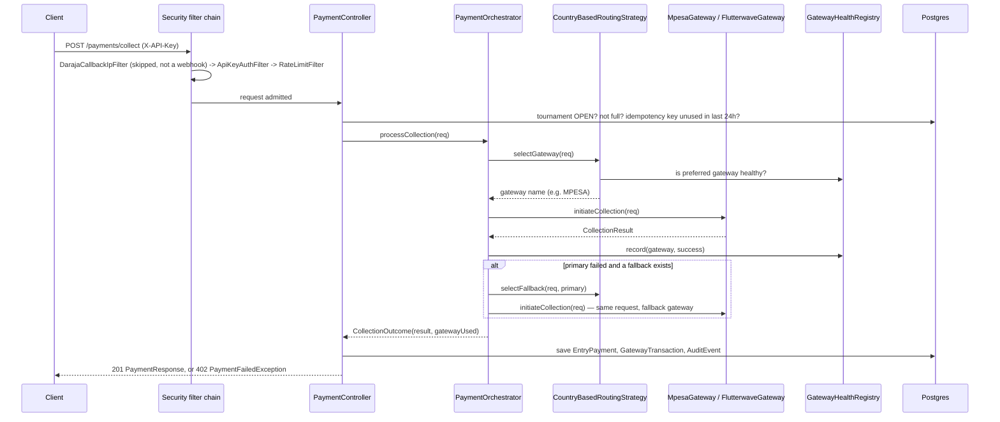
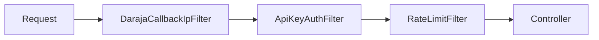

# `loot-api`

The assembled application: REST controllers, Spring Security, exception
handling, and the `@SpringBootApplication` entry point. Depends on all
three other modules (`loot-core`, `loot-persistence`, `loot-gateways`) —
this is the only module that boots a full Spring context, and the only one
that knows about HTTP.

For local setup, environment variables, and a curl-based API quick-start,
see the [root README](../README.md). This document is the reference for
how the module itself is built.

```xml
<!-- pom.xml — dependencies -->
loot-core, loot-persistence, loot-gateways
spring-boot-starter-web, spring-boot-starter-security, spring-boot-starter-validation, spring-boot-starter-actuator
org.mapstruct:mapstruct:${mapstruct.version}
org.springdoc:springdoc-openapi-starter-webmvc-ui:${springdoc.version}
com.bucket4j:bucket4j_jdk17-core:${bucket4j.version}   <!-- groupId is com.bucket4j, code imports io.github.bucket4j.* — that's correct, not a typo -->
```

`spring-boot-maven-plugin` excludes Lombok from the fat jar and runs the
`build-info` goal (see Actuator, below). The annotation processor chain is
ordered lombok → lombok-mapstruct-binding → mapstruct-processor — that
specific order matters, MapStruct needs to see Lombok-generated
getters/setters, not the other way around.

`LootApplication`:

```java
@SpringBootApplication
@EnableRetry
public class LootApplication { ... }
```

`@EnableRetry` lives here rather than in `loot-gateways`, where the
`@Retryable` methods it activates actually are — see
[`loot-gateways/README.md`](../loot-gateways/README.md) for why that's
worth knowing before restructuring either module.

## `controller/`

Four resource packages, each following the same shape: a `@RestController`,
request/response DTOs as records, and a MapStruct `@Mapper(componentModel =
"spring")` interface for entity↔DTO conversion.

| Package | Controller | Endpoints |
|---|---|---|
| `tournament/` | `TournamentController` | `POST /`, `GET /`, `GET /{id}`, `PATCH /{id}/close` |
| `payment/` | `PaymentController` | `POST /collect`, `GET /{reference}/status` |
| `disbursal/` | `DisbursalController` | `POST /trigger`, `POST /bulk`, `GET /{id}/status` |
| `gateway/` | `GatewayHealthController` | `GET /health` — gateway list is hardcoded (`"MPESA"`, `"FLUTTERWAVE"`), not derived from the injected gateway map |

Business rules worth knowing before touching either controller:

- **`PaymentController.collect`**: 404 if the tournament doesn't exist, 409
  if it's not `OPEN`, 409 if `countByTournamentIdAndStatusNot(id, "FAILED")`
  has already reached `maxEntries`, 409 if the idempotency key was used in
  the last 24h (see Idempotency, below). On a gateway decline, it throws
  `PaymentFailedException` (→ 402) **after** already persisting the failed
  `EntryPayment` and `GatewayTransaction` — the failure is recorded before
  the exception propagates, not instead of it.
- **`DisbursalController.trigger`/`bulk`**: both require the tournament to
  be `CLOSED` (409 otherwise). `bulk` unconditionally sets the tournament
  to `DISBURSED` once the run completes, regardless of whether every
  individual winner's payout actually succeeded — partial failure at the
  payout level doesn't block the tournament from being marked disbursed.

## `controller/webhook/`

`MpesaWebhookController` (`/confirmation`, `/result`, `/timeout`) and
`FlutterwaveWebhookController` (single `POST` handling both `charge.*` and
`transfer.*` event-type prefixes in one endpoint). Both are exempted from
API key auth and rate limiting since the gateways calling them can't
present an `X-API-Key`.

`FlutterwaveWebhookController.updateDisbursalStatus` is where Flutterwave's
own status vocabulary gets translated into the vocabulary the M-Pesa side
of disbursals already uses — see
[`loot-persistence/README.md`](../loot-persistence/README.md#status-vocabulary--read-this-before-adding-a-new-status-anywhere)
for why that translation exists and what it's normalizing.

## Request flow — collecting an entry fee

The clearest way to see how the modules cooperate is to follow one request
through the system: `POST /api/v1/payments/collect`.



Full detail on the routing/fallback/retry/health steps is in
[`loot-gateways/README.md`](../loot-gateways/README.md).

## Security — the filter chain, in actual execution order

`SecurityConfig.filterChain` wires four things into Spring Security's
chain. Order matters here and is easy to get subtly wrong (see the note
below) — this is the order they actually run in on every request:



1. **`DarajaCallbackIpFilter`** — only active on
   `/api/v1/webhooks/mpesa/**`. Checks the source IP against a configured
   CIDR allowlist (`daraja.callback-allowed-ips`, comma-separated). Runs
   *before* API key auth because Daraja can't authenticate as us at all —
   there's no key to check on a webhook call. **Fails open by design** if
   unconfigured (the `dev` profile default): logs a warning and lets the
   request through, rather than blocking every M-Pesa callback outright,
   since Daraja has no signature mechanism at all and sandbox source IPs
   aren't fixed. `staging`/`prod` are expected to set
   `DARAJA_CALLBACK_ALLOWED_IPS` for real — if this filter is logging
   "accepting M-Pesa callback ... without IP validation" in staging or
   prod, that's a configuration gap to close.
2. **`ApiKeyAuthFilter`** — everything except `/api/v1/webhooks/**` and
   `/actuator/health`. Hashes the `X-API-Key` header value with SHA-256,
   looks it up in `api_keys`, checks `active` and `expires_at`. On success,
   sets `UsernamePasswordAuthenticationToken("api-key:{id}", null,
   [ROLE_API_CLIENT])` in the security context. On failure, writes a 401
   JSON body directly and does **not** call `filterChain.doFilter()`.
3. **`RateLimitFilter`** — runs *after* API key auth, deliberately: a
   request with no/garbage key never gets a bucket allocated for it, since
   it's already been rejected by step 2. 100 requests/minute per API key,
   Bucket4j, refilled all at once each minute, in-memory
   `ConcurrentHashMap` (not multi-instance safe — a second app instance
   would have its own independent bucket state). 429 + `Retry-After: 60`
   on exhaustion.
4. **`CidrMatcher`** isn't a filter or a bean — it's a small package-private
   static IPv4/IPv6 CIDR-membership check used by `DarajaCallbackIpFilter`.

CSRF is disabled outright (`csrf.disable()`) — this is a stateless,
header-authenticated API with no cookie/session auth, so CSRF protection
doesn't apply here.

> **Registration-order gotcha (already hit once during development):**
> Spring Security's `addFilterBefore(filter, AnchorClass.class)` requires
> `AnchorClass` to already be a *registered* filter in the same builder
> call chain — you can't position a filter relative to another custom
> filter that hasn't been added yet. `SecurityConfig` therefore adds
> `apiKeyAuthFilter` (anchored to the built-in
> `UsernamePasswordAuthenticationFilter`) *before* it adds
> `darajaCallbackIpFilter` (anchored to `ApiKeyAuthFilter.class`), even
> though `DarajaCallbackIpFilter` runs first at request time. The Java
> statement order in the config and the actual runtime filter order are
> different things — don't assume one from the other when editing this
> class.

### Flutterwave webhook signature validation

`FlutterwaveWebhookController` validates the `verif-hash` header against
`flutterwave.webhook-secret-hash` using `MessageDigest.isEqual` —
constant-time comparison, so the check doesn't leak timing information
about where a guessed hash first diverges from the real one. This is
Flutterwave's actual signing mechanism: not HMAC, just a shared secret
string echoed back verbatim in the header. A missing or mismatched header
returns 401 before the payload is even parsed.

## Phone number encryption

`PhoneNumberConverter` (defined in `loot-core`, see
[`loot-core/README.md`](../loot-core/README.md#crypto)) is a JPA
`AttributeConverter<String, String>` applied explicitly via
`@Convert(converter = PhoneNumberConverter.class)` on
`EntryPayment.playerPhone` and `PrizeDisbursal.recipientPhone`.

AES-256-GCM, keyed from `app.encryption.phone-key` (base64, 32 raw bytes,
configured per-environment here in `loot-api`'s `application-*.yml`). Each
encryption generates a fresh random 12-byte IV, prepends it to the
ciphertext, and base64-encodes the result for storage:

```
stored value = base64( iv[12 bytes] || ciphertext-with-GCM-tag )
```

Because the IV is random per call, **the same phone number never encrypts
to the same stored value twice** — correct, standard AEAD practice, but it
means the column can no longer be queried by equality. Migration V8 (see
[`loot-persistence/README.md`](../loot-persistence/README.md#schema)) drops
the now-useless index on `entry_payments.player_phone` for exactly this
reason.

Encryption is **at rest only** — API responses still return the decrypted
plaintext phone number, since the application needs it (to display, to
call a gateway with, etc.). This protects the database at rest, not the
value in transit or in a logged API response. If a masked/last-4-digits
display is needed for an operator-facing UI, that's a presentation-layer
choice, not something this backend enforces.

The `dev` profile ships a **committed, dev-only default key** in
`application-dev.yml` so local setup works without extra configuration —
explicitly commented as dev-only; `staging`/`prod` require
`PHONE_ENCRYPTION_KEY` with no default.

## Idempotency

`GatewayTransactionRepository.findByIdempotencyKeyAndCreatedAtAfter(key, since)`
(in `loot-persistence`) backs a 24-hour idempotency window on
`POST /payments/collect`. A client either supplies an `Idempotency-Key`
header or one is generated (`UUID.randomUUID()`) per request. If a
`GatewayTransaction` with the same key exists and was created within the
last 24 hours, the request is rejected with 409 rather than reprocessed —
after 24 hours, the same key can be reused (rows aren't deleted, the check
is just time-bounded).

This is a different idempotency concept from the `transactionId` reused
across a primary→fallback retry (see
[`loot-gateways/README.md`](../loot-gateways/README.md)) — the idempotency
key protects against a *client* retrying the same logical request; the
shared `transactionId` on fallback protects against the *same* logical
request being double-counted if it partially succeeded on the gateway that
was about to be abandoned.

## HTTPS / HSTS

`SecurityConfig` always sets an HSTS header
(`includeSubDomains(true)`, `maxAgeInSeconds(31536000)`), but only enforces
HTTPS-only (`requiresChannel().anyRequest().requiresSecure()`) when
`app.security.require-https=true` — off by default (so local HTTP dev
keeps working), on in `staging`/`prod`. Both of those profiles also set
`server.forward-headers-strategy=framework`, which is what makes
`request.isSecure()` correctly reflect `X-Forwarded-Proto` from a
TLS-terminating platform proxy (Railway/Render-style deployments) rather
than always evaluating to `false` because the app itself only ever sees
plain HTTP from the proxy.

## `exception/`

`GlobalExceptionHandler` (`@RestControllerAdvice`) is the single place
every error response shape gets built:

| Exception | Status | `errorCode` |
|---|---|---|
| `TournamentNotFoundException` | 404 | `TOURNAMENT_NOT_FOUND` |
| `PaymentFailedException` | 402 | `PAYMENT_FAILED` |
| `MethodArgumentNotValidException` | 400 | `VALIDATION_FAILED` (field:message pairs joined with `; `) |
| `ResponseStatusException` | its own status | its own reason, as `errorCode` |
| anything else | 500 | `INTERNAL_ERROR` (message intentionally not leaked) |

Every response is an `ApiError(errorCode, message, Instant timestamp,
String traceId)`.

> **`traceId` is declared but not yet populated.** It reads
> `MDC.get("traceId")` — **nothing in the codebase currently sets
> `MDC.put("traceId", ...)`**, so `traceId` in every `ApiError` response is
> `null` today. The field and the read-side plumbing exist in anticipation
> of a request-scoped trace ID (typically set by a servlet filter early in
> the chain, or via Micrometer Tracing) that hasn't been added yet. Wiring
> it up is a self-contained addition — a filter that generates or extracts
> a trace ID per request and puts it in MDC before the security filter
> chain — at which point `traceId` starts actually being useful for
> correlating a user-reported error against backend logs.

## Structured logging

`staging` and `prod` set:

```yaml
logging:
  structured:
    format:
      console: logstash
```

Spring Boot's built-in structured logging support (Boot 3.4+, no extra
Logback dependency needed), formatting every console log line as
Logstash-shaped JSON, MDC included automatically. `dev` leaves the default
plain-text console format for local readability.

`PaymentOrchestrator` (in `loot-gateways`) populates
`transactionId`/`gateway`/`amount` into MDC around every gateway call, in a
`finally` block so it never leaks onto an unrelated log line — full detail
in [`loot-gateways/README.md`](../loot-gateways/README.md).

## Actuator

`spring-boot-starter-actuator` exposes `health`, `metrics`, and `info`
(`management.endpoints.web.exposure.include`). `/actuator/health` is the
one endpoint excluded from API key auth — it needs to be reachable by a
load balancer or platform health check that has no API key.
`/actuator/metrics` and `/actuator/info` sit behind the normal
`X-API-Key` requirement like everything else. `/actuator/info` returns
real build metadata (artifact, version, build time) because
`spring-boot-maven-plugin` runs the `build-info` goal — without that,
`/actuator/info` would just return `{}`.

## OpenAPI

`springdoc-openapi-starter-webmvc-ui` generates docs from `@Tag`/
`@Operation`/`@Schema` annotations already present on the controllers and
DTOs — served at `/swagger-ui.html`, which (like every non-webhook,
non-health endpoint) requires the same `X-API-Key` header to actually load
in a browser. See the [root README](../README.md)'s API quick-start
section for the practical workaround.

## Testing

Controllers are tested with `@WebMvcTest` + `@AutoConfigureMockMvc(addFilters
= false)` (security filters bypassed deliberately — they're tested on
their own, directly, as plain `OncePerRequestFilter`s with mocked
request/response objects) plus `@Import(...MapperImpl.class)` for the
MapStruct-generated mapper (needed explicitly because `@WebMvcTest`'s
restricted scanning doesn't pick up generated implementation classes on
its own). `SecurityConfigIntegrationTest` is the one test that *does*
import the real `SecurityConfig` to prove the filter chain is actually
wired correctly end to end, not just correct in each filter's own
isolated unit test.
